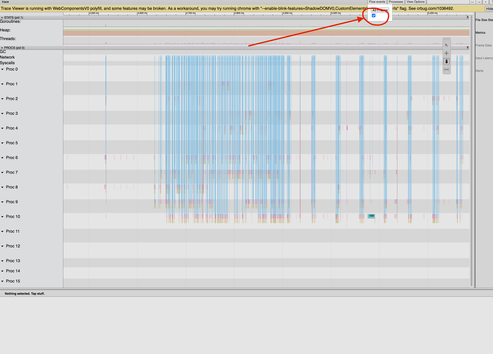

# Temporal-Yugabyte

The code in this repository implements a [Temporal](https://temporal.io) [CustomDataStore](https://pkg.go.dev/go.temporal.io/server/temporal#WithCustomDataStoreFactory) using [Yugabyte](https://www.yugabyte.com/) [YCQL](https://docs.yugabyte.com/preview/api/ycql/).

## Target Audience
Temporal users running self-hosted instances can now leverage the power of Yugabyte YCQL as their primary data store. This integration offers a leap in performance, reliability, and ease of operation, surpassing alternatives such as Apache Cassandra. For Yugabyte users, integrating Temporal's durable execution model into their stack is now a seamless process, maximizing their existing investment and expertise.

## Quickstart

You may start a local instance of temporal-yugabyte using docker-compose:

```shell
docker-compose -f docker/docker-compose/quick-start.yml up
```
This command will deploy a Temporal instance with Yugabyte as the primary datastore, and Elasticsearch as the visibility store.  You may find the Temporal UI at http://localhost:8080 and the Temporal API at localhost:7233.

## Status

Most features(*) are code-complete, stable, and used in production. All code changes are verified through an extensive unit and integration test suite via continuous integration (CI) to ensure the quality of each change.

> (*) Nexus support is still a work in progress. We've turned off the tests for Nexus for now, but we're eagerly awaiting your contributions to make it a reality. Pull requests are more than welcome!

## History

[The Manetu Smart Data Platform](https://www.manetu.com/) relies heavily on various third-party frameworks and services, including Yugabyte and Temporal. The throughput, latency, scalability, and reliability of these components have a direct effect on the overall performance of the Manetu product. Therefore, we make every effort to tailor their use and configuration to achieve optimal results.

Temporal supports using either PostgreSQL or Cassandra as its [primary data store](https://docs.temporal.io/temporal-service/persistence#persistence). Since Yugabyte supports both [PostgreSQL](https://docs.yugabyte.com/preview/api/ysql/) and [Cassandra CQL](https://docs.yugabyte.com/preview/api/ycql/) APIs, it may appear straightforward to use Yugabyte as a replacement for the native versions.

However, there were a few issues:

  - While Temporal worked out of the box with Yugabyte's PostgreSQL API, the Temporal CQL driver offers [substantial performance benefits](https://medium.com/vymo-engineering/scaling-temporal-load-testing-with-postgres-cassandra-elasticsearch-monitoring-alerting-1176b7a4968b) over the SQL driver.

  - There are subtle differences in Yugabyte's YCQL APIs, which makes it incompatible with the current CQL driver in Temporal (See [Issue #3511](https://github.com/temporalio/temporal/issues/3511) for details)

Our situation presented a choice: run two databases - Yugabyte as our platform's primary datastore and Cassandra as the Temporal datastore - or sponsor an effort to add a YCQL driver to Temporal. As you've read this far, our decision should be clear. This code is a YCQL driver for Temporal, enabling us (and you!) to run a converged stack with a single database layer provided by Yugabyte without sacrificing performance or compatibility.

### Design

Our initial approach was to try a minor inline modification to the existing CQL code in the upstream Temporal project similar to [conditional changes made to support ScyllaDB](https://github.com/temporalio/temporal/commit/ae5cad888b850f424f83de86cba74952eae484eb). However, our analysis concluded that the required changes to the DDL/DML to adapt and optimize for YCQL were too extensive, making a conditionalized approach impractical. We also determined that the Temporal core supports a first-class ability to register CustomDataStore types, making it conducive to working with an arbitrary persistence layer without requiring any changes to the core code.

Therefore, this project started with a fork of the [Temporal Cassandra driver](https://github.com/temporalio/temporal/tree/main/common/persistence/cassandra) and heavily modified the code to create a YCQL-optimized variant. This project incorporates the upstream Temporal core as an unmodified dependency and registers a new CustomDataStore type, preserving all other upstream features intact.

The result is a drop-in replacement for the Temporal server binary/container, offering all the features of the upstream Temporal service, plus the addition of a new storage option for Yugabyte YCQL, configured as a custom datastore option.

### Differences from the original code

A few of the key differences between the original upstream CQL code and the new Yugabyte driver are as follows:

  - Use of the Yugabyte-optimized [gocql](https://pkg.go.dev/github.com/yugabyte/gocql) client.
  - Replacement of  most of the [logged batches](https://docs.datastax.com/en/cql-oss/3.x/cql/cql_reference/cqlBatch.html) with YCQL [transactions](https://docs.yugabyte.com/preview/api/ycql/dml_transaction/).
  - Splitting the executions table into multiple domain-specific subtables since Yugabyte supports inter-table transactions.
  - Optimizing the cluster columns by collapsing most of them into composite partition keys to eliminate extra b-tree lookups that are no longer required to deal with Cassandra's limited transaction model.
  - Removal of non-conforming code such as TTLs on secondary indices.

The result is a Temporal server that supports connecting to a Yugabyte YCQL database as its primary data store via a driver registered as a CustomDataStore type.   We have found that the resulting service is faster, more reliable, and easier to manage than the Apache Cassandra cluster that it replaces. We are sharing the code with the community in the hope that it will be helpful to others in both the Temporal and Yugabyte communities.

## How to Use

Manetu publishes the compiled artifacts as Docker containers for convenient deployment in containerized environments such as Kubernetes. Generally speaking, the deployment of Yugabyte YCQL enabled Temporal is similar to existing self-hosted Temporal deployment methods, with the following adjustments:

- Substitute the Temporal server instances with a binary/container from this project
- Add the configuration for Yugabyte YCQL as a CustomDataStore
- Apply the Yugabyte-specific schema

The following guide is geared towards users deploying to Kubernetes using the [Temporal Helm chart](https://github.com/temporalio/helm-charts), but the steps outlined should be easily adaptable to other deployment flows.

### Binary Substitution

Substitute the container image used for the various Temporal services (Frontend, History, Matching, etc) with the temporal-yugabyte image from our [published releases](https://github.com/manetu/temporal-yugabyte/pkgs/container/temporal-yugabyte):

```yaml
server:
  image:
    repository: ghcr.io/manetu/temporal-yugabyte:latest
```

### Configure the Yugabyte YCQL Custom Datastore

> The following assumes that you are using [PR #658](https://github.com/temporalio/helm-charts/pull/658)

```yaml
server:
  config:
    persistence:
      defaultStore: yugabyte
      default:
        driver: custom
      additionalStores:
        yugabyte:
          customDatastore:
            name: "yugabyte"
            options:
              hosts:  "yugabyte-yb-tservers"
              keyspace: "mykeyspace"
              replicationFactor: 3
              user: cassandra
              tls:
                enabled: true
                enableHostVerification: false
                caFile: /etc/yugabyte/ca.crt
```
### Apply the Yugabyte-specific schema

You will need to deploy the DDL update to Yugabyte manually. You may leverage the `admin-tools` image supplied by this project for convenience.

```yaml
apiVersion: batch/v1
kind: Job
metadata:
  name: temporal-schema-init
spec:
  template:
    metadata:
      name: temporal-schema-init
    spec:
      restartPolicy: OnFailure
      securityContext: {}
      serviceAccountName: default
      containers:
        - name: temporal-defaultstore-init
          image: ghcr.io/manetu/temporal-yugabyte:latest-admin-tools
          imagePullPolicy: IfNotPresent
          command:
            - /bin/bash
            - -c
            - |
              set -eux

              temporal-cassandra-tool create -k $CASSANDRA_KEYSPACE --replication-factor "3"
              temporal-cassandra-tool setup-schema -v "0.0"
              temporal-cassandra-tool update-schema --schema-dir $TEMPORAL_SCHEMA_PATH/yugabyte/temporal/versioned
          env:
            - name: CASSANDRA_HOST
              value: "yugabyte-yb-tservers"
            - name: CASSANDRA_PORT
              value: "9042"
            - name: CASSANDRA_KEYSPACE
              value: "mykeyspace"
            - name: CASSANDRA_USER
              value: cassandra
            - name: CASSANDRA_PASSWORD
              valueFrom:
                secretKeyRef:
                  name: temporal-yugabyte-secret
                  key: password
            - name: CASSANDRA_ENABLE_TLS
              value: "true"
            - name: CASSANDRA_TLS_CA
              value: /etc/yugabyte/ca.crt
            - name: CASSANDRA_TLS_DISABLE_HOST_VERIFICATION
              value: "true"
          volumeMounts:
            - mountPath: /etc/yugabyte
              name: yugabyte-secrets
              readOnly: true
          resources: {}

```

## Quantifying Performance

See [Benchmarking](./benchmarking/README.md)

## Development

This repository is self-contained and can be used as is for development though the process is still slightly cumbersome. Improvements welcome.

### Step 1

In one terminal, run the backend dependencies with docker-compose

```shell
$ docker-compose -f docker/docker-compose/develop.yml up
```

### Step 2

In a second terminal, run

```shell
$ make install-schema
```

### Step 3

From an IDE such as Goland, set up an execution for ./cmd/server with the following switches:

```shell
--env development --allow-no-auth start
```

Then launch the environment in the debugger.

### Step 4

Once temporal is running, execute the following command within a free shell, such as the one used in Step 2

```shell
$ temporal operator namespace create default
```

### Step 5

Use your cluster!

Helpful suggestions:

1. You can open the Temporal UI by visiting http://localhost:8080
2. You can generate some workflow activity by running `lein test` from the integration directory

## Profiling

If you wish to try to optimize performance, you may find the following info helpful:

The development environment integrates with [pprof](https://pkg.go.dev/net/http/pprof). It exposes an HTTP listener on port 7936.

### Tracing

Run the following to generate a 15-second trace:

```shell
curl -o trace.out http://localhost:7936/debug/pprof/trace?seconds=15
```

Once the system completes the trace, you may render it with

```shell
go tool trace trace.out
```

> Tip: Enable "Flow Events" in the process trace window


