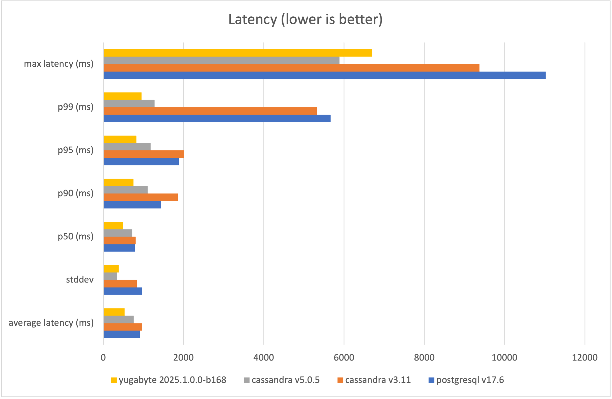
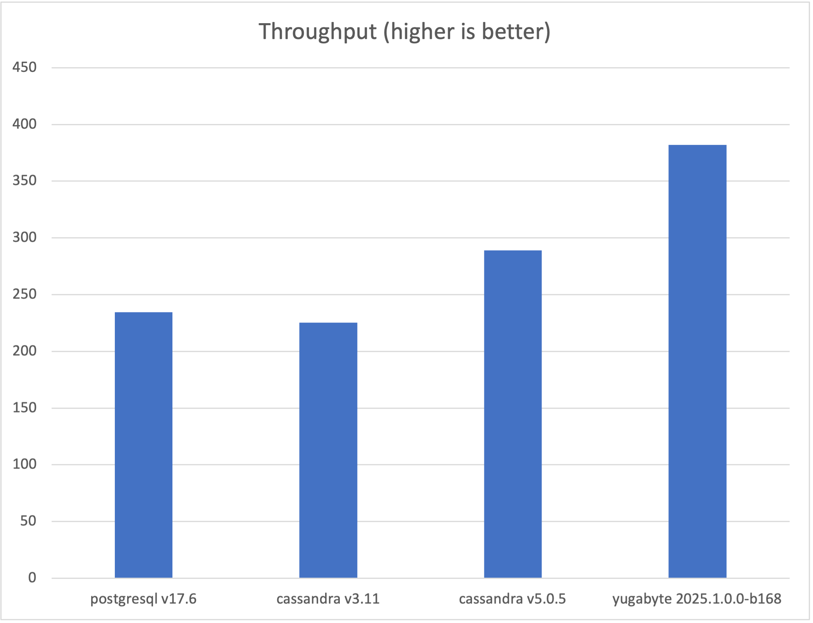
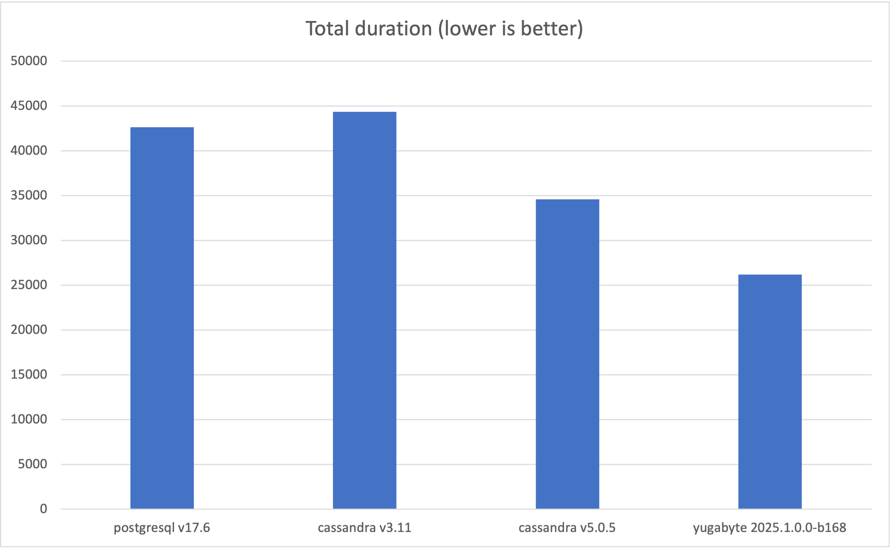

# Benchmarking

One of the goals of the temporal-yugabyte project is to exploit the performance characteristics of Yugabyte YCQL.  We created a tool [temporal-benchmark](https://github.com/manetu/temporal-benchmark) to help quantify the resulting performance in a way that it may be easily compared to other options, or to candidate enhancements to the YCQL driver.

## Test Case 1 - Single replica deployments

For simplicity, we will compare the Yugabyte YCQL driver with other available upstream drivers in a single-replica configuration.  Real-world deployments will likely consist of distributed replicas, larger resources, and so on.  However, configuring these production-grade deployments is more complicated and thus challenging for peers to reproduce, so this test focuses on achieving repeatable results with ease rather than squeezing out every last ounce of performance.

### System Specifications

- Apple Macbook Pro (Mac16,5) - M4 Max (16 cores, 128G memory)
- Apple OSX 15.6.1
- [Orbstack](https://orbstack.dev/) 1.10.3

> N.B. Orbstack is configured to have unlimited cores (16) and 64Gi memory

### Software Configuration

- Manetu [temporal-benchmark](https://github.com/manetu/temporal-benchmark)
- Temporal 1.27.3 (upstream for non-Yugabyte, and temporal-yugabyte for YugabyteDB)
- Elasticsearch 7.10.1
- Databases tested
  - PostgreSQL 17.6
  - Cassandra 3.11 (Temporal default Cassandra)
  - Cassandra 5.0.5 (Latest Cassandra release)
  - Yugabyte 2025.1.0.0-b168

### Methodology

For each database, we utilize Docker Compose to configure a comprehensive Temporal environment, comprising Elasticsearch for visibility and the selected database as the primary datastore.  We then launch an instance of temporal-benchmark using the `combo` subcommand, and specifying 256 concurrent requests over 10k requests.  We subsequently tear down the docker-compose environment.

> N.B. The compose files used for testing are available [here](./compose).

We run each database configuration three times (with a complete setup and teardown cycle) and record the best run as indicated by the highest throughput, discarding the other two.

### Results

|                          | average latency (ms) | stddev  | p50 (ms) | p90 (ms) | p95 (ms) | p99 (ms) | max latency (ms) | total duration (ms) | workflows/s |
| ------------------------ | -------------------- | ------- | -------- | -------- | -------- | -------- | ---------------- | ------------------- | ----------- |
| postgresql v17.6         | 911.207              | 959.511 | 788.419  | 1438.491 | 1884.727 | 5666.889 | 11027.278        | 42646.082           | 234.49      |
| cassandra v3.11          | 967.307              | 835.69  | 809.065  | 1861.654 | 2010.627 | 5322.411 | 9372.161         | 44388.663           | 225.28      |
| cassandra v5.0.5         | 759.32               | 345.207 | 723.373  | 1109.261 | 1180.358 | 1281.085 | 5883.813         | 34615.98            | 288.88      |
| yugabyte 2025.1.0.0-b168 | 530.683              | 386.085 | 494.535  | 753.667  | 828.319  | 951.452  | 6702.931         | 26185.284           | 381.89      |

