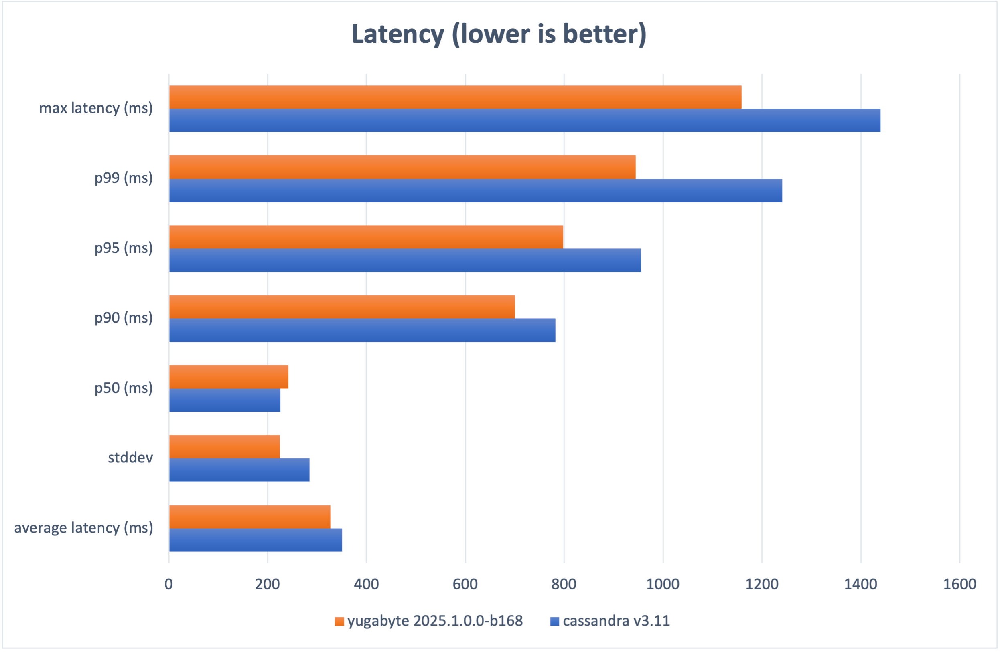
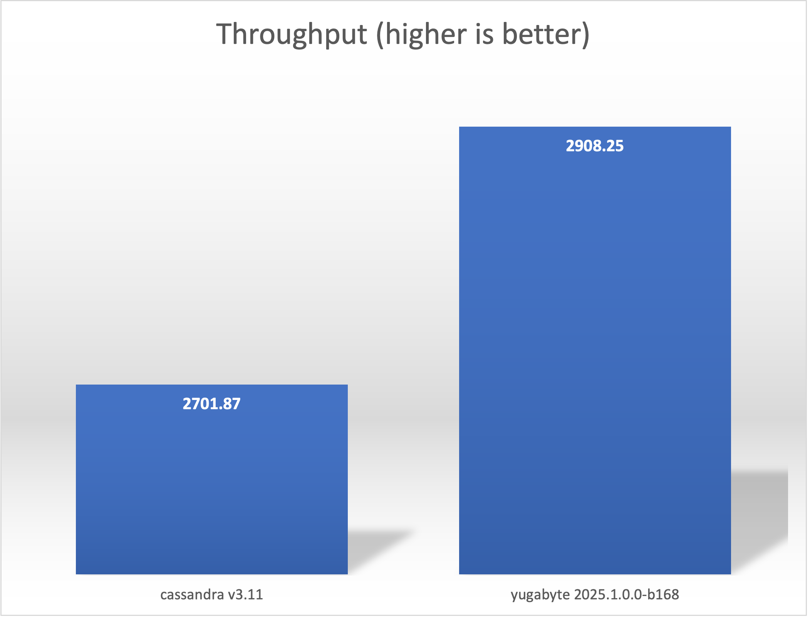
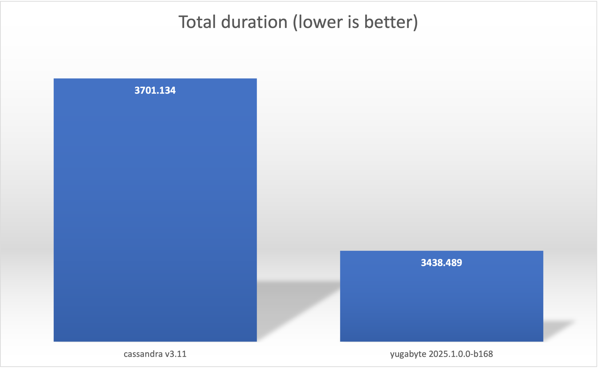

## 6 node EKS cluster

### System Specifications

- Amazon Web Services (AWS) Elastic Kubernetes Service (EKS) - v1.31
- [m7i.4xlarge](https://aws.amazon.com/ec2/instance-types/m7i/) (16 cores, 64Gi memory)
    - nodepool "database" - 6 nodes tainted for exclusive use by the selected database
    - nodepool "primary" - 3 general nodes used for hosting temporal and the temporal-benchmark pods

### Software Configuration

- Manetu [temporal-benchmark](https://github.com/manetu/temporal-benchmark)
- Temporal 1.27.3 via temporal-yugabyte image for both upstream and yugabyte databases
- Elasticsearch 7.10.1
- Databases tested
    - Cassandra 3.11 (Temporal default Cassandra, 5.x not yet supported)
    - Yugabyte 2025.1.0.0-b168

### Methodology

For each database, we utilize [Ansible playbooks](../../ansible) to configure a comprehensive Temporal environment within a dedicated VPC on EKS, comprising Elasticsearch for visibility and the selected database as the primary datastore.

Example:
```
$ ansible-playbook deploy-eks.yml -i inventories/eks.yml --extra-vars @profiles/medium.yml
```

Each respective database is configured to consume all six dedicated nodes from the "database" node pool.  The temporal-benchmark `worker` is deployed colocated in the cluster to run along side the Temporal stack.

Next, we expose the Temporal HOST:PORT using `kubectl port-forward`.

Example:
```
$ kubectl -n temporal-benchmark port-forward svc/temporal-frontend 7233
```
We then launch a local instance of temporal-benchmark using the `client` subcommand (1), and specifying 1024 concurrent requests over 10k requests.  

Example:
```
$ temporal-benchmark --temporal-namespace benchmark client --client-concurrency 1024 --client-requests 10000
```

We run each database configuration three times and record the best run as indicated by the highest throughput, discarding the other two.  The `temporal-benchmark` kubernetes namespace is deleted after each type of database is tested, effectively tearing it down while leaving EKS up, and rebuilt fresh for the next test.

|                          | average latency (ms) | stddev  | p50 (ms) | p90 (ms) | p95 (ms) | p99 (ms) | max latency (ms) | total duration (ms) | workflows/s |
| ------------------------ | -------------------- | ------- | -------- | -------- | -------- | -------- | ---------------- | ------------------- | ----------- |
| cassandra v3.11          | 350.136              | 284.811 | 225.341  | 782.681  | 955.197  | 1241.132 | 1439.328         | 3701.134            | 2701.87     |
| yugabyte 2025.1.0.0-b168 | 327.271              | 224.625 | 242.157  | 700.666  | 797.31   | 944.669  | 1158.571         | 3438.489            | 2908.25     |





> (1) The client is running on a laptop in central Massachusetts while the EKS cluster is running in `us-east-2` (Ohio)
