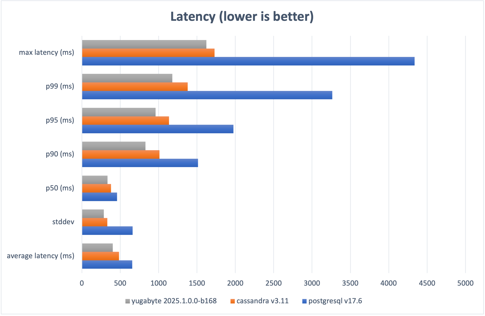
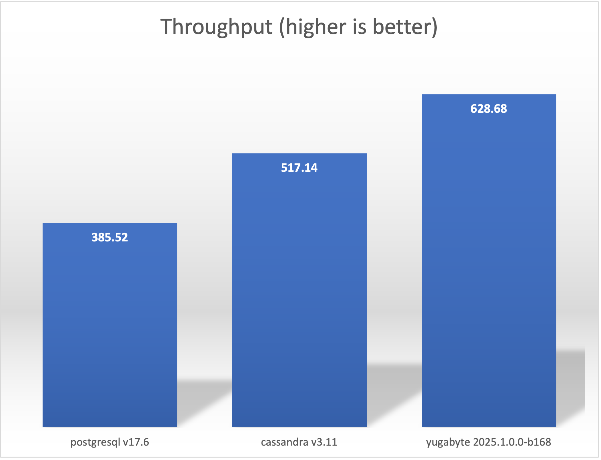
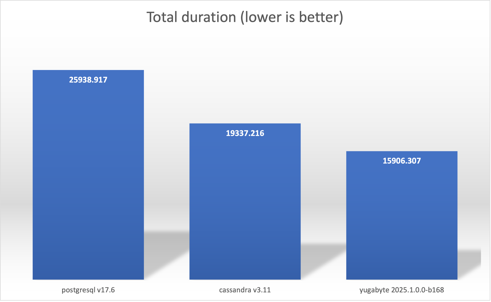

## Single replica deployments via docker-compose

For simplicity, we will compare the Yugabyte YCQL driver with other available upstream drivers in a single-replica configuration.  Real-world deployments will likely consist of distributed replicas, larger resources, and so on.  However, configuring these production-grade deployments is more complicated and thus challenging for peers to reproduce, so this test focuses on achieving repeatable results with ease rather than squeezing out every last ounce of performance.

### System Specifications

- Apple Macbook Pro (Mac16,5) - M4 Max (16 cores, 128G memory)
- Apple OSX 15.6.1
- [Orbstack](https://orbstack.dev/) 1.10.3

> N.B. Orbstack is configured to have unlimited cores (16) and 64Gi memory

### Software Configuration

- Manetu [temporal-benchmark](https://github.com/manetu/temporal-benchmark)
- Temporal 1.27.3 (upstream for non-Yugabyte, and temporal-yugabyte for YugabyteDB)
- Elasticsearch 7.10.1
- Databases tested
    - PostgreSQL 17.6
    - Cassandra 3.11 (Temporal default Cassandra, 5.x not yet supported)
    - Yugabyte 2025.1.0.0-b168

### Methodology

For each database, we utilize [Docker Compose](./compose) to configure a comprehensive Temporal environment, comprising Elasticsearch for visibility and the selected database as the primary datastore.  

Example:
```
$ docker-compose -f  benchmarking/compose/postgres.yml up
```
We then launch an instance of temporal-benchmark using the `combo` subcommand, and specifying 32 concurrent requests over 10k requests.  We subsequently tear down the docker-compose environment.  We run each database configuration three times (with a complete setup and teardown cycle) and record the best run as indicated by the highest throughput, discarding the other two.

### Results

|                          | average latency (ms) | stddev  | p50 (ms) | p90 (ms) | p95 (ms) | p99 (ms) | max latency (ms) | total duration (ms) | workflows/s |
| ------------------------ | -------------------- | ------- | -------- | -------- | -------- | -------- | ---------------- | ------------------- | ----------- |
| postgresql v17.6         | 657.229              | 661.099 | 457.578  | 1514.776 | 1975.294 | 3264.369 | 4335.548         | 25938.917           | 385.52      |
| cassandra v3.11          | 484.463              | 331.56  | 380.841  | 1012.564 | 1135.399 | 1380.448 | 1729.252         | 19337.216           | 517.14      |
| yugabyte 2025.1.0.0-b168 | 402.898              | 285.609 | 333.45   | 828.555  | 959.988  | 1180.025 | 1623.996         | 15906.307           | 628.68      |




