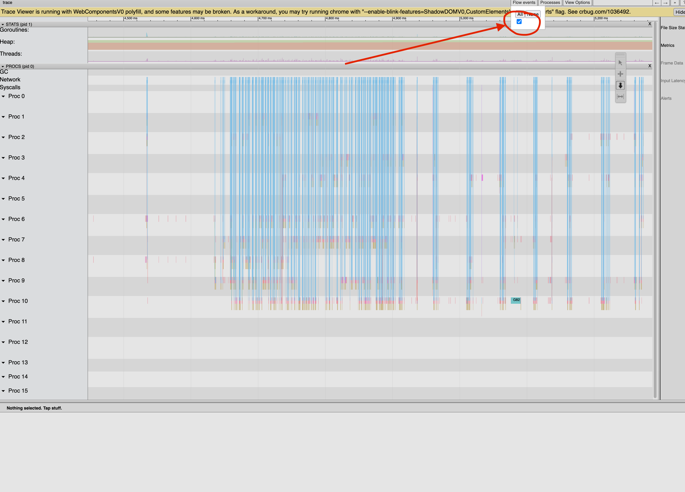

# Development Guide

This guide covers local development setup, running the server in a debugger, and profiling. For running the test suites, including reproducing CI locally, see the [Testing Guide](./testing.md).

## Local Development Setup

### Step 1: Start Backend Dependencies

In one terminal, run the backend dependencies with docker-compose:

```shell
docker compose -f docker/docker-compose/develop.yml up
```

### Step 2: Install Schema

In a second terminal, run:

```shell
make install-schema
```

> If this fails with `-ep: command not found`, `temporal-cassandra-tool` isn't on your `PATH`. Point `SCHEMA_TOOL` at the copy built by Step 1 of the [Testing Guide](./testing.md) instead: `make install-schema SCHEMA_TOOL=./target/temporal-cassandra-tool`. Unlike `integration/run.sh`, this target drops and recreates the keyspace, so it's safe to re-run.

### Step 3: Run the Server

From an IDE such as Goland, set up an execution for `./cmd/server` with the following switches:

```shell
--env development --allow-no-auth start
```

Then launch the environment in the debugger.

### Step 4: Create Default Namespace

Once Temporal is running, execute the following command:

```shell
temporal operator namespace create default
```

### Step 5: Use Your Cluster

Helpful suggestions:

1. You can open the Temporal UI by visiting http://localhost:8080
2. You can generate some workflow activity by running `lein run` from the `integration/clojure` directory. See the [Testing Guide](./testing.md) for the full test suites, including reproducing CI locally with `act`.

## Profiling

The development environment integrates with [pprof](https://pkg.go.dev/net/http/pprof). It exposes an HTTP listener on port 7936.

### Tracing

Run the following to generate a 15-second trace:

```shell
curl -o trace.out http://localhost:7936/debug/pprof/trace?seconds=15
```

Once the system completes the trace, you may render it with:

```shell
go tool trace trace.out
```

> Tip: Enable "Flow Events" in the process trace window


